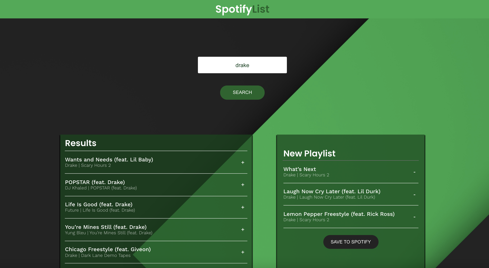
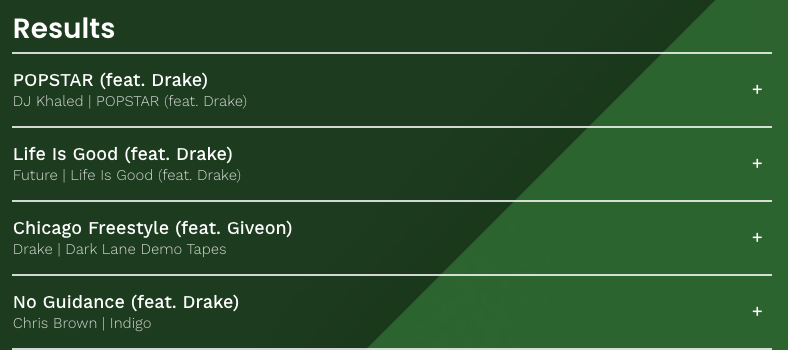
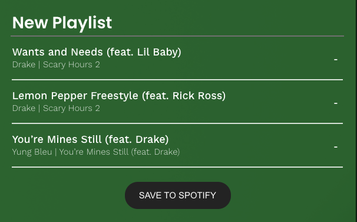

# SpotifyList

## Introduction

Built a Web Application with React components, passing state, and requests with the [Spotify API](https://developer.spotify.com/documentation/web-api/) that allows users to search the Spotify library, create a custom playlist, then save it to their Spotify account.

## Features

###### Screenshot of the web application.

1. User can search for a song, album or artist name.
2. Search results will show up in the 'Results' section.
3. Tracks can be added to the playlist section by clicking the '+' icon to the right of each track (see image below).

4. Tracks can be removed from the playlist section by clicking the '-' icon (see image below).

5. User can change the name of their playlist by updating the input field which contains the default value "New Playlist".
6. Once the user has created their custom playlist, they can click the 'Save to Spotify' button to add the playlist to their account.
